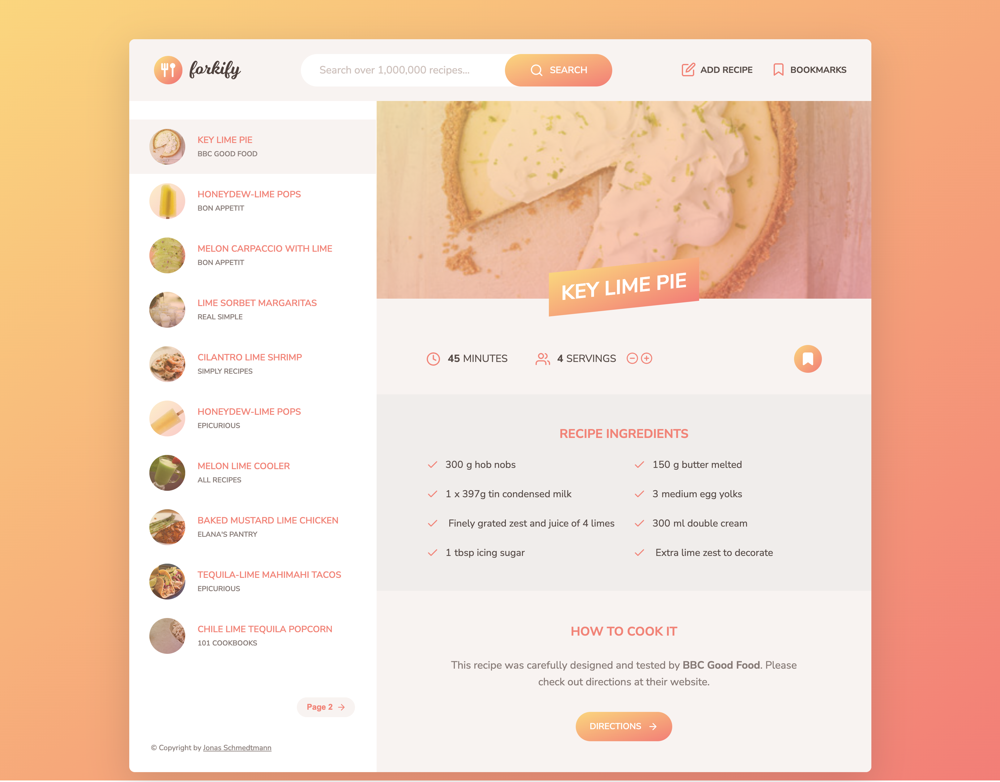

# Forkify - Use the Forkify API to Build A Recipe App

## Link to demo

[Forkify demo site](https://forkify-alun.netlify.app/)

## Project Description

Forkify uses the Forkify API to fetch and display recipe data. It allows users to search for recipes, bookmark them, adjust serving sizes, and view detailed directions.
